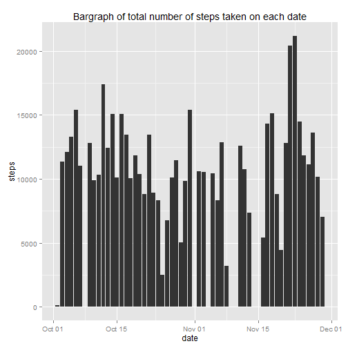

Reproducible Research - Course Project 1
========================================


---
### Loading and Pre-processing the data

```r
suppressWarnings(suppressMessages(require(dplyr)))
suppressWarnings(suppressMessages(require(lubridate)))
suppressWarnings(suppressMessages(require(ggplot2)))
```


```r
data <- read.csv("activity.csv")
data <- mutate(data, date = ymd(date))
```

### Total number of steps taken each day


```r
sum_steps = summarize(group_by(data,date),sum(steps, na.rm = T))
names(sum_steps) <- c("date","total_steps")
head(sum_steps,10)
```

```
## Source: local data frame [10 x 2]
## 
##          date total_steps
## 1  2012-10-01           0
## 2  2012-10-02         126
## 3  2012-10-03       11352
## 4  2012-10-04       12116
## 5  2012-10-05       13294
## 6  2012-10-06       15420
## 7  2012-10-07       11015
## 8  2012-10-08           0
## 9  2012-10-09       12811
## 10 2012-10-10        9900
```

The following **histogram** shows the frequency count of total number of steps taken per day.


```r
ggplot(sum_steps,aes(x = total_steps)) + geom_histogram(binwidth = 2500,fill="red") + ggtitle("Histogram of Total Number of steps taken per day")
```


However the following **bargraph** shows the total number of steps taken on each date during the entire period of data.


```r
ggplot(data,aes(x = date, y = steps)) + geom_bar(stat = "identity") + ggtitle("Bargraph of total number of steps taken on each date")
```



### Mean and median number of steps taken each day

The missing values in the dataset have been ignored for calculating the mean and median.

**MEAN**


```r
steps_mean <- mean(sum_steps$total_steps, na.rm=TRUE)
print(paste("The mean steps per day is: ", steps_mean))
```

```
## [1] "The mean steps per day is:  9354.22950819672"
```

**MEDIAN**


```r
steps_median <- median(sum_steps$total_steps, na.rm=TRUE)
print(paste("The median steps per day is: ", steps_median))
```

```
## [1] "The median steps per day is:  10395"
```


### Time series plot of the average number of steps taken

Average number of steps across all days are calcluated for each interval.


```r
AvgStepsPerInterval <- aggregate(steps ~ interval, data = data, mean, na.rm=TRUE)
```

The interval is taken as a time variable on the x-axis in the following time series plot.

For the next question, computation has been done below to mark it on the graph.


```r
maxStepsInterval <- AvgStepsPerInterval[which(AvgStepsPerInterval$steps == max(AvgStepsPerInterval$steps)),1]
maxStepsInAnInterval <- AvgStepsPerInterval[which(AvgStepsPerInterval$steps == max(AvgStepsPerInterval$steps)),2]
```


```r
ggplot(AvgStepsPerInterval, aes(x = interval, y = steps)) + geom_line(colour = "green3", size = 1.5) + ggtitle("Time Series of Average Number of steps per Interval") + geom_vline(aes(xintercept = maxStepsInterval), colour = "red", linetype="dashed")
```


### The 5 min interval which contains the maximum numbers of steps.


```r
print(paste("Interval containing the maximum number of steps ", maxStepsInterval, " with ", maxStepsInAnInterval, " steps."))
```

```
## [1] "Interval containing the maximum number of steps  835  with  206.169811320755  steps."
```

This interval is also marked in the above graph.

### Imputing missing data

The *steps* variable in the original dataset contains several missing values denoted by NAs.


```r
missingdata <- sum(is.na(data$steps))
print(paste("There are", missingdata, "missing data points in Steps variable"))
```

```
## [1] "There are 2304 missing data points in Steps variable"
```

These missing values of steps count will be replaced by the **mean** of the steps count.


```r
newdata <- mutate(data, steps = ifelse(is.na(data$steps),mean(data$steps, na.rm=TRUE), steps))
```

The overall mean of the entire period is chosen because on somedays, all the step count values are missing, hence it is not useful to compute mean information on those particular days.

### Histrogram of the steps count after removing missing data


```r
sum_steps_new = summarize(group_by(newdata,date),sum(steps))
names(sum_steps_new) <- c("date","total_steps")
ggplot(sum_steps_new,aes(x = total_steps)) + geom_histogram(binwidth = 2500,fill="red") + ggtitle("Histogram of Total Number of steps taken per day after removing missing data")
```


**MEAN after removing missing data**


```r
steps_mean_new <- mean(sum_steps_new$total_steps)
print(paste0("The new mean steps per day is: ", steps_mean_new , " OLD mean: " , steps_mean))
```

```
## [1] "The new mean steps per day is: 10766.1886792453 OLD mean: 9354.22950819672"
```

**MEDIAN after removing missing data**


```r
steps_median_new <- median(sum_steps_new$total_steps)
print(paste0("The new median steps per day is: ", steps_median_new, " OLD median: " , steps_median))
```

```
## [1] "The new median steps per day is: 10766.1886792453 OLD median: 10395"
```

* Mean value increased compared to the previous value.
* Median value increased compared to the previous value. 

### Comparing the average number of steps across weekdays and weekends

We create a new factor column in the new data with the weekday and weekend classification


```r
newdata$dayname <- weekdays(newdata$date)
newdata$daytype <- as.factor(ifelse(newdata$dayname == "Saturday" |
                                 newdata$dayname == "Sunday", "weekend", "weekday"))
```

We take the averages for each interval separately on weekdays and weekends


```r
averagebyDayType <- aggregate(steps ~ interval + daytype, data=newdata, mean)
ggplot(averagebyDayType, aes(interval, steps,colour = daytype)) + geom_line() + facet_grid(daytype ~ .) +
  xlab("Interval") + ylab("Average Number of steps") 
```


